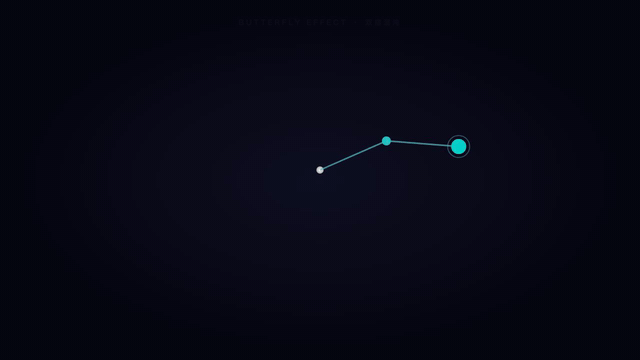
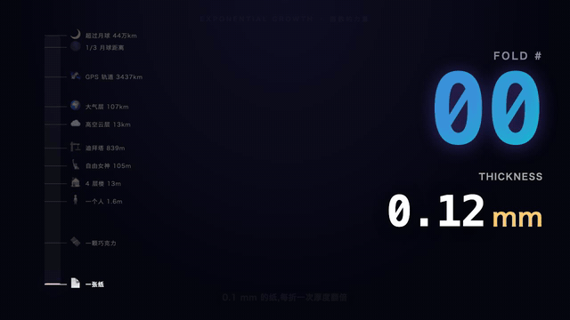

# knowledge-explainer-skill

**Author:** nyx研究所 · [GitHub](https://github.com/znyupup) · [B站 @nyx研究所](https://space.bilibili.com/4330525) · 小红书 @nyx研究所 · [X @znyupup_music](https://x.com/znyupup_music)

把一份 **markdown 文稿**,自动生成**讲解动画视频** — Remotion + AI Agent 驱动。

```bash
node cli.js examples/script.md out/example.mp4
```

→ 一份文稿 → 一行命令 → 出 mp4。

## 它真正能做什么(showcase)

不是文字 + emoji 的"PPT 感"幻灯片 — 是**真正的动画 / 物理仿真 / 数据可视化**。

### 🦋 双摆混沌 · 蝴蝶效应

两个一模一样的双摆,初始角度差 0.001°,几秒后轨迹完全分开 — 用拉格朗日方程实时数值积分。



→ 见 [`examples/double_pendulum.md`](examples/double_pendulum.md) + [`custom/DoublePendulum.jsx`](custom/DoublePendulum.jsx)

### 📄 一张纸对折 42 次 · 指数增长

0.1mm 的纸对折 42 次比月球还远 — log-scale 柱状图 + 11 个里程碑(从巧克力到迪拜塔到大气层到月球)+ 单位实时切换。



→ 见 [`examples/paper_fold.md`](examples/paper_fold.md) + [`custom/PaperFold.jsx`](custom/PaperFold.jsx)

### 🔒 抖音算法 · 信息茧房

24 张视频卡 grid,你点赞了科技 → 算法 5 波收敛 → 整个屏幕变蓝 — 离散状态机 + 时间轴脚本编排。


→ 见 [`examples/algorithm_bubble.md`](examples/algorithm_bubble.md) + [`custom/AlgorithmBubble.jsx`](custom/AlgorithmBubble.jsx)

---

## 怎么用

| 输入 | 输出 |
|---|---|
| 一份分页 markdown | 1280×720 mp4,带动画、过渡、配色 |

每页文稿对应一个**版式**(template),内置 6 种**排版起手**:

| 版式 | 用途 |
|---|---|
| `Title` | 章节开场标题页 |
| `ContentCard` | 标题 + 列表(知识点 / 步骤 / 要点) |
| `TwoColumn` | 输入 → 箭头 → 输出对比 |
| `Triangle` | 几何题专用(动画绘制 + 公式 + 答案) |
| `BeforeAfter` | 数值/时长前后对比(波形条 / 时间轴削减) |
| `Outro` | 收尾大字 + CTA |

**真正的能力在 `custom/`** — 让 agent 写任何 React/SVG/物理仿真组件,文件名跟 script.md 段名一致即可识别。3 个 showcase(双摆/对折纸/算法茧房)就是这么写出来的。

## 安装

```bash
git clone https://github.com/znyupup/knowledge-explainer-skill
cd knowledge-explainer-skill
npm install
# macOS: 解 Gatekeeper 限制
xattr -drs com.apple.quarantine node_modules
```

依赖只有 Remotion(自动装好)。需要系统级 `ffmpeg`(`brew install ffmpeg`)。

## 用法

### 1. 写一份 script.md

参考 [`examples/script.md`](examples/script.md):

````markdown
---
title: 三角形面积怎么算
fps: 30
width: 1280
height: 720
---

## Title
title: 三角形面积怎么算?
subtitle: 5 分钟讲明白
duration: 4

## ContentCard
title: 已知什么
color: "#6c5ce7"
items:
  - 📐 底边 = 10cm
  - 📏 高 = 6cm
  - 🧮 面积 = 底×高÷2
duration: 5

## Triangle
title: 套公式算一下
base: 10
height: 6
unit: cm
formula: 底 × 高 ÷ 2
result: 30
resultUnit: cm²
duration: 9

## Outro
title: 一份文稿,出片
cta: 安装 skill 试试
duration: 4
````

每段 `## 模板名` 后面跟该模板的入参(YAML 风格)。`duration` 单位是秒。

### 2. 跑命令

```bash
node cli.js examples/script.md out/my_video.mp4
```

输出:

```
🔍 解析文稿...
   📄 标题: 三角形面积怎么算
   🎬 5 个场景, 共 26s
🤖 生成 React 代码...
🎬 调用 Remotion 渲染...
✅ 成片输出: out/my_video.mp4 (1.7 MB, 13.9s 渲染)
```

### 3. 看成片

```bash
open out/my_video.mp4
```

## 给 Agent 用(自定义版式)

如果你需要的版式不在内置 6 个里,**让你的 AI agent 写**。3 个 showcase 就是这么诞生的:

| Showcase | 范式 | 关键技术 |
|---|---|---|
| 双摆混沌 | 物理仿真 | useMemo 预计算微分方程数值积分,逐帧索引 |
| 一张纸对折 | 指数 + log scale | useCurrentFrame → ease-out 映射到 fold count,SVG path 累积 |
| 抖音算法 | 离散状态机 | 时间轴脚本(每帧的网格状态预生成),CSS transform 动画 |

### 例:加一个"⏱ 倒计时" 版式

在 `script.md` 里写:
```markdown
## CountdownTimer
seconds: 5
message: 即将进入下一页
duration: 6
```

跑 cli 时会报错:`找不到模板 CountdownTimer`。
告诉你的 agent:
> "在 custom/CountdownTimer.jsx 里实现这个 Remotion 组件,参考 custom/_TEMPLATE.jsx.example 和现有的 custom/DoublePendulum.jsx"

agent 写完后再跑一次 cli,就能渲染了。

## 推荐 Agent

| Agent | 命令 |
|---|---|
| **Claude Code**(推荐) | `claude code` 然后 "帮我用这份文稿做视频" |
| OpenClaw | 同上 |
| Hermes | `hermes skills add` |

## 工作原理

```
script.md
   ↓ parser.js 解析
[scene 列表]
   ↓ generator.js 生成
src/_generated.jsx + src/_generated_index.jsx
   ↓ npx remotion render
out/video.mp4
```

每个 scene 是 `{template, props, durationInFrames}` 三元组。Generator 把它们组合成一个 Remotion `<Composition>`,用 `<Sequence>` 串联,然后调 Remotion CLI 渲染。

## 👤 作者

**nyx研究所** — [GitHub](https://github.com/znyupup) · [B站 @nyx研究所](https://space.bilibili.com/4330525) · 小红书 @nyx研究所 · [X / Twitter](https://x.com/znyupup_music)

姊妹项目: [ai-video-editing-skill](https://github.com/znyupup/ai-video-editing-skill) — AI Agent 自动剪辑旅行 Vlog

## 📄 License

MIT — 随便用,标注来源就行。

## 致谢

- [Remotion](https://www.remotion.dev/) — 用 React 渲染视频的核心引擎
- [ffmpeg](https://ffmpeg.org/) — 视频处理的瑞士军刀

## 反馈

发 issue 到 [GitHub](https://github.com/znyupup/knowledge-explainer-skill/issues)。
