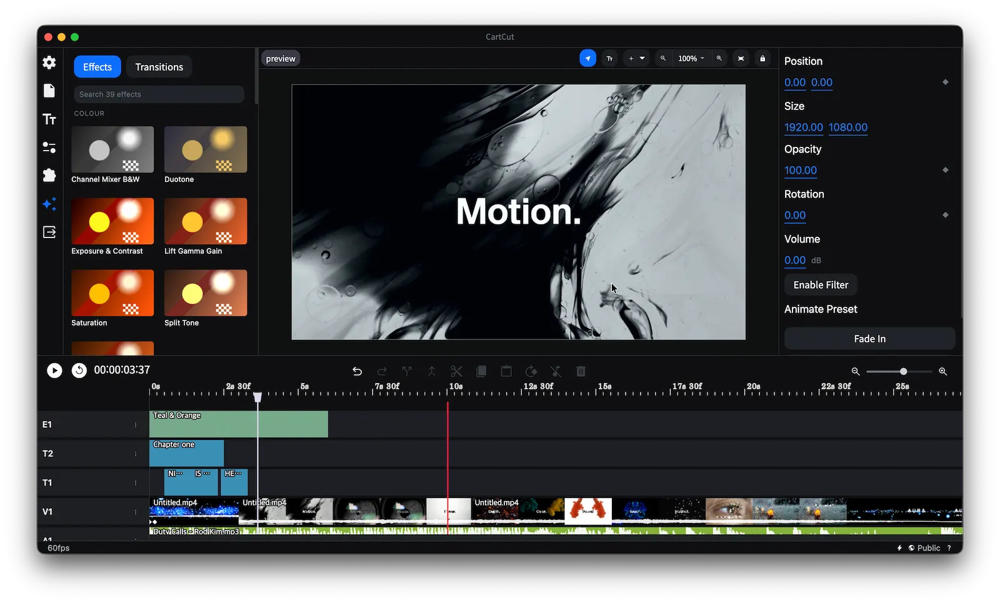

<h1 align='center'>
CartCut
</h1>

<p align='center'>
The finest AI video editor
</p>



<p align='center'>

<a href="https://cartesiancs.com/cartcut"></a>
&nbsp;
<a href="#"></a>
&nbsp;
<a href="#"></a>
&nbsp;


</p>

#

<p align='center'>
English | <a href="./docs/README.ko.md">한국어</a>
</p>

<p align='center'>
<a href="https://www.youtube.com/watch?v=Bh06VOYSMIM">View Demo</a> · <a href="https://github.com/cartesiancs/cartcut/issues">Report Bugs</a> · <a href="https://github.com/cartesiancs/cartcut/releases"><b>Download</b></a> · <a href="https://github.com/cartesiancs/cartcut/issues/new">Suggest Features </a>
</p>

#

Video editing software designed for motion effects and versatility.

In addition to essential features like basic cut editing, animation, sound mixing, external library extensions, project management, and text editing, our software offers a wide range of powerful tools.

It also supports layer-based editing, which differs from traditional track-based editing. This approach makes it easier to apply multiple effects to individual assets, providing greater flexibility and creative control.

## About The Project

You can check out a limited demo of the website at the [following link](https://demo.nugget.cartesiancs.com/).

## Features

- Cut Edit
- Support for all standard formats (mp4, mov, mp3, wav...)
- Audio mixing
- Fast rendering with FFmpeg
- Unlimited layers
- Cross Platform
- Re-position, Scale, Opacity, Rotation animation, Keyframe
- Add Text
- External Extension
- Save&Load Project as File
- Multilingual Support
- 8k Edit & 4k Edit & more resolution
- Screen Record & Audio Record
- Chromakey
- AI Auto Caption (whisper)
- Blur Effect (WebGL)
- Draw shape
- Effects and Transitions
- and more...

## Editing with Claude Code

Cartcut exposes its live timeline over MCP, so [Claude Code](https://claude.com/claude-code)
can edit the project you are looking at: cutting from a transcript, adding
subtitles, trimming, restaging clips, motion, transitions and effects. Its edits
land in your own undo history, so ⌘Z takes them back.

Install the plugin, which carries both the editing skill and the connection:

```
/plugin marketplace add cartesiancs/cartcut
/plugin install cartcut-editing@cartcut
```

It asks for your Cartcut MCP token once. Open Cartcut, click the ⚡ icon at the
bottom right, and copy the connection command; the token is the UUID after
`Bearer `. Then ask for an edit in plain language.

The skill is also on the skills CLI, for Claude Code and for other agents:

```
npx skills add cartesiancs/cartcut --skill cartcut-editing -a claude-code -g
```

That route installs the skill alone, so run the ⚡ panel's `claude mcp add` line
afterwards to connect the bridge. Take one route or the other, not both.

Any other MCP client (Claude Desktop, Cursor, Codex) connects through
[`@cartesiancs/cartcut-mcp`](packages/mcp-bridge), which is also listed in the official MCP
Registry. It finds the token by itself:

```
npx -y @cartesiancs/cartcut-mcp
```

[plugins/cartcut-editing/README.md](plugins/cartcut-editing/README.md) has the
details, including what to do when it will not connect.

## Installation

First, install dependencies.

```
npm install
```

and, **Download** ffmpeg and ffprobe into `./bin`, in a folder named for the
target you are building. Only the folder matching your machine is needed to run
the app locally; `npm run build` reads whichever one it is packaging for.

```
bin/
  darwin-arm64/{ffmpeg,ffprobe}     Apple Silicon
  darwin-x64/{ffmpeg,ffprobe}       Intel Mac
  win32-x64/{ffmpeg.exe,ffprobe.exe}
```

Compatible binaries can be downloaded from
https://github.com/cartesiancs/ffmpeg4nugget

The macOS builds must be **native**. An x86_64 binary runs on Apple Silicon
through Rosetta 2 at roughly half the export speed, and nothing in the app will
say so. Check with `lipo -archs bin/darwin-arm64/ffmpeg`, which must print
`arm64`. The build also has to carry `libx264`, `libx265`, `libvpx-vp9`,
`prores_ks` and the VideoToolbox encoders; `ffmpeg -encoders` lists them.

next, **Permission** grant is required. Please enter the command below to grant permission for bin folder.

`chmod -R 777 bin`

## Running

```
npm run dev
npm run start
```

## Releasing

`npm run build:osx` signs, notarizes and uploads the macOS build to a **draft** GitHub release. Publishing that draft runs [`mirror-r2.yml`](.github/workflows/mirror-r2.yml), which copies the release to Cloudflare R2 and updates the manifest the website's download button reads:

- `https://download.cartesiancs.com/cartcut/latest.json`: version plus the Apple Silicon and Intel `.dmg` URLs
- `https://download.cartesiancs.com/cartcut/latest.txt`: the version alone, as plain text

The GitHub release is the source of truth, and in-app auto-update still reads it. To mirror a tag that was published before the workflow existed: `gh workflow run mirror-r2.yml -f tag=v0.5.3`.

## Roadmap

Our ultimate goal is to empower creators to produce motion graphics effortlessly. We hope they can achieve stunning motion effects without relying on heavy software like After Effects.

Please refer to the [roadmap file](./docs/ROADMAP.md) for more details.

## Contributors

 <a href = "https://github.com/cartesiancs/cartcut/graphs/contributors">
   
 </a>

## License

We are adopting the MIT license. [license file](./LICENSE)
