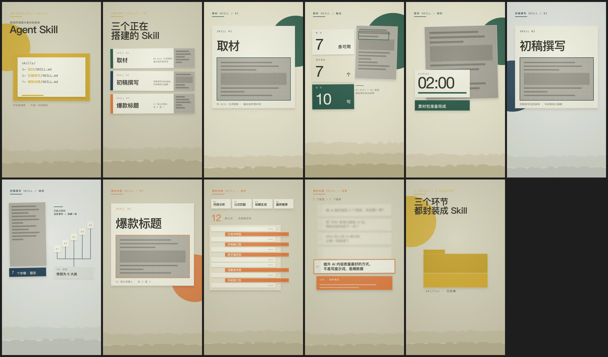

# gbro-collage-info

半调纸拼贴风信息动画 Agent Skill。给一份口播逐字稿，AI 帮你挑出适合做成信息动画的段落，经三道确认门后，产出 1080×1920 竖屏、带拟音音轨的 mp4 动画——纯 HTML/CSS/GSAP 本机渲染（[HyperFrames](https://github.com/heygen-com/hyperframes)），**不调用任何图片生成模型**。

*Editorial halftone paper-collage info-graphic animations from your voiceover script, rendered locally with HTML/CSS/GSAP — no image-generation models involved. English intro [below](#english).*

## 效果

| 抽屉抽出 | 数字锚定 | 推焦收敛 | 三联卡翻面 |
|---|---|---|---|
|  |  |  |  |

> GIF 无声；实际成片是 30fps mp4，内置卡纸落位、翻面、抽出等拟音音轨。GIF 中的中文文案来自一次真实项目的逐字稿，仅作风格演示。

一次口播视频的 11 条末帧（每条动画的收帧就是一张可读海报）：



## 它做什么

从逐字稿里挑出"讲信息"的段落——数字冲击、流程结构、清单收敛、对比翻转、结果高光——做成同一视觉家族的信息图动画：米色纸场、卡纸剪片、单一点色、半调截图、stop-motion 定格。

工作流是三道确认门，每道门停下来等你确认，不跳门：

```text
Gate 1  选段 + 主动效分配 → 确认名单
Gate 2  静态样帧（headless Chrome 截图 + 拼图）→ 确认构图
Gate 3  HyperFrames 动画 + 拟音 + QA → 交付 mp4
```

风格上的硬规则（详见 [references/style-system.md](references/style-system.md)）：

- 纸场底不用渐变；一件信息 = 一张卡纸剪片
- 一帧只有一处点色批注 + 一个出画大色块
- 信息只落在画面上 2/3（y ≤ 1280），底部 640px 是字幕安全区
- 真实截图过半调处理；没拿到截图前用抽象灰条占位，**绝不画假界面**
- 屏幕文字只用逐字稿里有的事实，不替内容编数据

动效全部对齐 10fps 定格网格（`steps()` easing），八种主动效全片不重复（详见 [references/motion-grammar.md](references/motion-grammar.md)）。

## 安装

这是一个 [Agent Skill](https://docs.claude.com/en/docs/claude-code/skills)（SKILL.md 格式），Claude Code 直接可用：

```bash
git clone https://github.com/pyang5166/gbro-collage-info.git ~/.claude/skills/gbro-collage-info
```

首次使用先自检环境：

```bash
~/.claude/skills/gbro-collage-info/scripts/check_setup.sh
```

依赖：Node ≥ 22、Chrome（headless 截样帧）、ffmpeg/ffprobe。渲染器 `hyperframes@0.7.56` 首次 `npx` 时自动下载。

## 使用

对 Claude 说：

- 「拼贴信息动画：这是我下期视频的逐字稿……」（全流程挑段）
- 「用 gbro-collage-info 把这段做成信息动画，就一条」（指定段落直出）

不适合的段落它会拦下来：界面操作演示归录屏、情绪独白归实拍或角色动画，不硬做。

## 仓库结构

```
SKILL.md                  # 主流程：三道门 + 色本 + 写作纪律
references/
├── style-system.md       # 风格系统：纸场/剪片/点色/半调/撕边/布局
├── motion-grammar.md     # 动效语法：定格网格 + 八种主动效 + 拟音 cue
└── production.md         # 渲染环境、项目结构、QA 检查单
assets/
├── collage.css           # 全部风格类与变量（纸纤维/网点/撕边/卡纸/半调）
├── gsap.min.js           # 本地 GSAP（渲染期无网络请求）
└── sfx/                  # 10 个拟音音效（来源 Mixkit，免版权可商用）
scripts/
├── check_setup.sh        # 环境自检
└── new_project.sh        # 一键建 HyperFrames 项目（assets 自包含拷入）
evals/evals.json          # 3 条行为评测
demo/                     # README 演示素材
```

## English

**gbro-collage-info** is an Agent Skill (SKILL.md format, works with Claude Code) that turns segments of a voiceover script into editorial halftone paper-collage info-graphic animations: beige paper field, cut-paper cards, one accent color per frame, halftone screenshots, stop-motion easing. Output is 1080×1920 vertical mp4 with built-in foley (paper clicks, flips, whooshes), rendered locally via [HyperFrames](https://github.com/heygen-com/hyperframes) from pure HTML/CSS/GSAP — no image-generation models.

The workflow has three confirmation gates: segment selection (which lines deserve an animation, each assigned a unique hero motion), static hero frames (headless-Chrome screenshots for approval), then animation + foley + QA. Hard rules include: screen text may only quote facts present in the script (blank placeholder cards otherwise), no fake UI is ever drawn for missing screenshots, and every animation ends exactly on its approved hero frame.

The skill's instructions and trigger phrases are written in Chinese; the visual system works for any language, though layouts are tuned for CJK-density text.

Requirements: Node ≥ 22, Chrome, ffmpeg. Run `scripts/check_setup.sh` first. SFX sourced from [Mixkit](https://mixkit.co/) (royalty-free, commercial use OK).

## License

MIT © 狗哥笔记
