<div align="center">

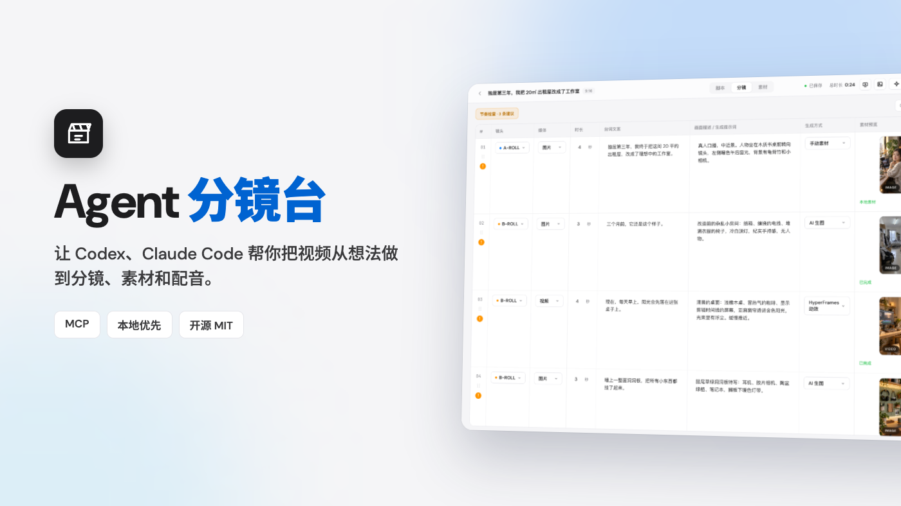

<h1>Agent 分镜台 · Agent Storyboard</h1>

<p><b>让 Codex、Claude Code 帮你把视频从想法做到分镜、素材和配音。</b><br>
一个本地优先的分镜工作台：Agent 负责写和生成，你在一张表里检查、调整、验收。</p>

<p>
  <a href="./LICENSE"></a>
  
  
  
  
  
</p>

<p>
  <a href="#-快速开始">快速开始</a> ·
  <a href="#-它是怎么工作的">工作方式</a> ·
  <a href="#-功能一览">功能</a> ·
  <a href="#-环境与依赖">环境</a> ·
  <a href="#-mcp-工具">MCP 工具</a> ·
  <a href="#-开发">开发</a>
</p>

</div>

---

## 为什么做它

做一条短视频，脚本在文档里，分镜在表格里，图片在生图网页里，配音在另一个工具里，素材散落在文件夹里。每换一个窗口，上下文就丢一次。

Agent 分镜台把这些收进同一张**本地分镜表**：

- **Agent 直接写入**：一句话让 Agent 建好完整项目，不需要控制浏览器。
- **结果自动回填**：Agent 生成的图片、视频和配音，落进对应镜头，不用手动对文件名。
- **你只做验收**：所有自动化结果都在表格里，能一眼看到、直接改。
- **数据都在本机**：项目、脚本和素材保存在你的电脑上。

<div align="center">
  
  <br><sub>Agent 生成素材，结果自动回填到对应镜头</sub>
</div>

## 🚀 快速开始

需要 Node.js 18 或更高版本，以及 Codex 或 Claude Code 之一。

**1. 安装插件**

<table>
<tr>
<td width="50%" valign="top">

**Codex**

```bash
codex plugin marketplace add Yuuhann1999/agent-storyboard
codex plugin add agent-storyboard@agent-storyboard
```

</td>
<td width="50%" valign="top">

**Claude Code**

```bash
claude plugin marketplace add Yuuhann1999/agent-storyboard
claude plugin install agent-storyboard@agent-storyboard
```

</td>
</tr>
</table>

安装后新开一个对话，让 MCP 工具重新加载（Claude Code 里可以用 `/mcp` 确认 `agent-storyboard` 已连接）。

**2. 打开分镜台**

```text
打开 Agent 分镜台。
```

插件会自动启动内置的本地工作台，并给出链接（默认 `http://127.0.0.1:43218`），在侧边栏或浏览器里打开即可。

**3. 创建第一个项目**

```text
创建一个 9:16 的短视频分镜项目，主题是“独居第三年，我把 20㎡ 出租屋改成了工作室”，
风格干净、节奏快，适合抖音。写好台词和画面描述。
```

**4. 生成素材**

在分镜台里点镜头的「生成素材」，或点顶栏的「批量生成」，然后对 Agent 说：

```text
处理 Agent 分镜台里所有待生成素材。
```

## 🧭 它是怎么工作的

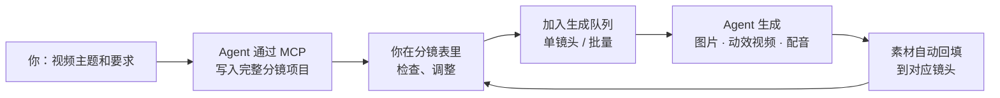

分镜台是一个本地网页服务，Agent 通过 MCP 工具和它对话。三种生成方式按镜头选择：

| 生成方式 | 做什么 | 由谁完成 |
| --- | --- | --- |
| **AI 生图** | 按画面描述生成图片 | Codex 用自带的 image_gen；Claude Code 通过 `generate_storyboard_image` 调用本机 Codex 出图 |
| **HyperFrames / Remotion 动效** | 用代码渲染字幕、信息图、转场等视频 | Agent 在本地渲染（需要对应插件和渲染工具链） |
| **手动素材** | 自己拍的、自己剪的 | 你上传图片或视频 |

## ✨ 功能一览

### 一张表看完整个分镜

镜头类型、媒体、时长、台词、画面描述、生成方式、素材预览和备注都在同一行。长项目切到「紧凑」，一屏看更多镜头；节奏有问题的镜头会直接标出提示。

<table>
<tr>
<td width="50%">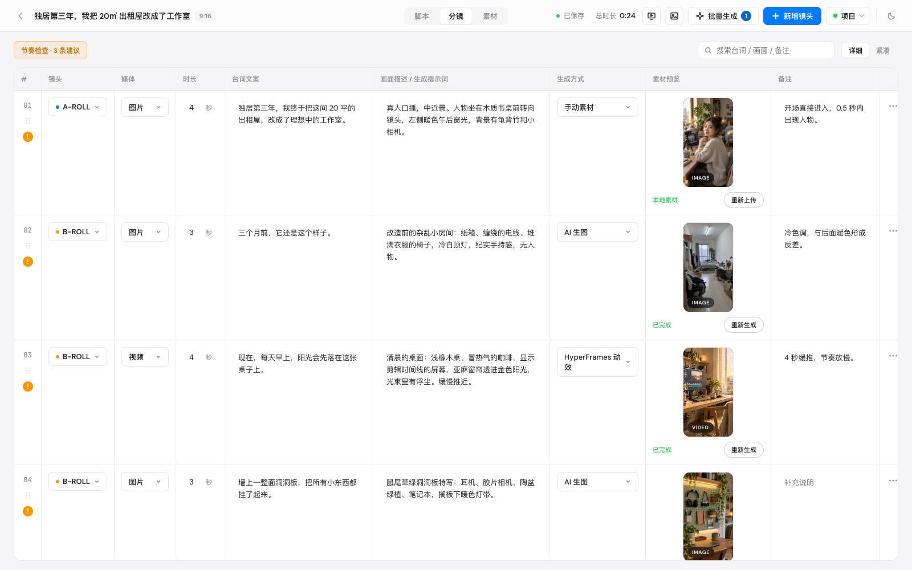<br><sub>详细视图</sub></td>
<td width="50%">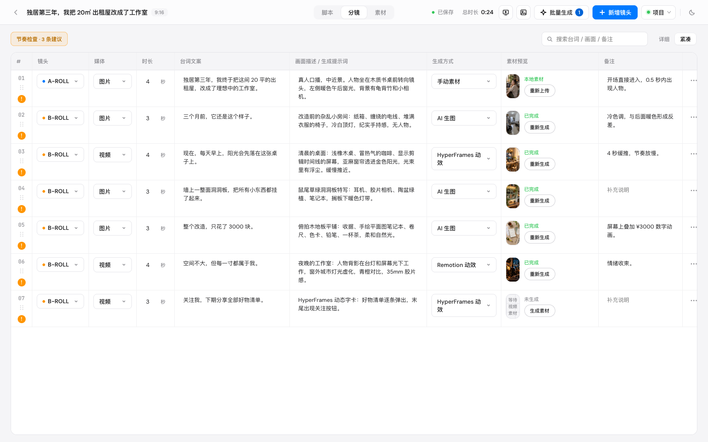<br><sub>紧凑视图，一屏 7 个镜头</sub></td>
</tr>
</table>

- 拖拽或 `Alt + ↑/↓` 调整顺序，复制镜头、在下方插入，误删可以撤销。
- 素材文件名带镜头序号，调整顺序后会自动同步，不会互相覆盖。
- 按台词、画面、备注搜索；顶栏实时显示「生成中 / 排队 / 失败」数量，点一下定位。

### 口播配音，和台词对齐

在脚本页生成配音，可以描述声音风格，也可以上传参考音频克隆音色。生成后用本地 Whisper 识别，把配音对齐到每个镜头的台词，再一键应用镜头时长。

<div align="center">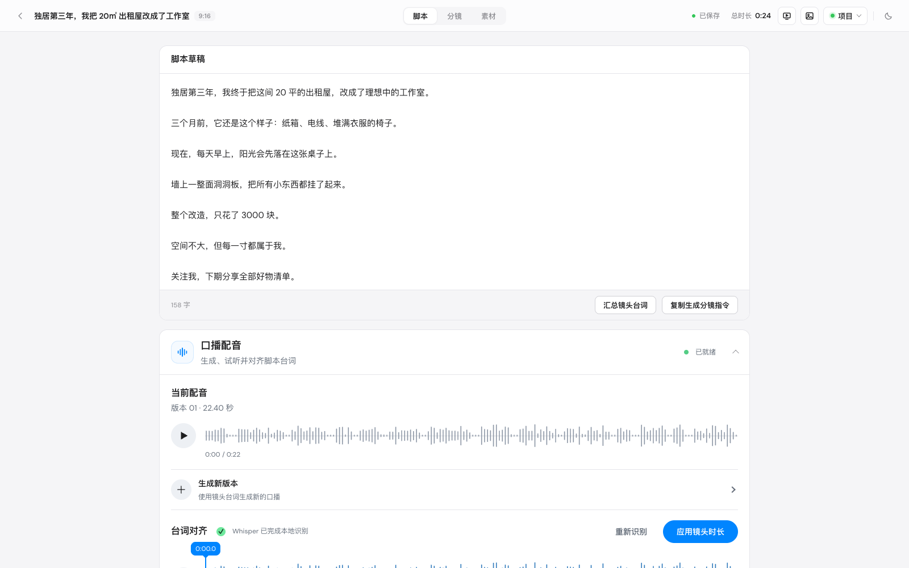</div>

### 素材总览与封面工作台

只列做出来的素材，一眼看到进度。封面按竖屏 9:16 和横屏 16:9 分别管理，支持模板、参考图和提示词。

<table>
<tr>
<td width="50%">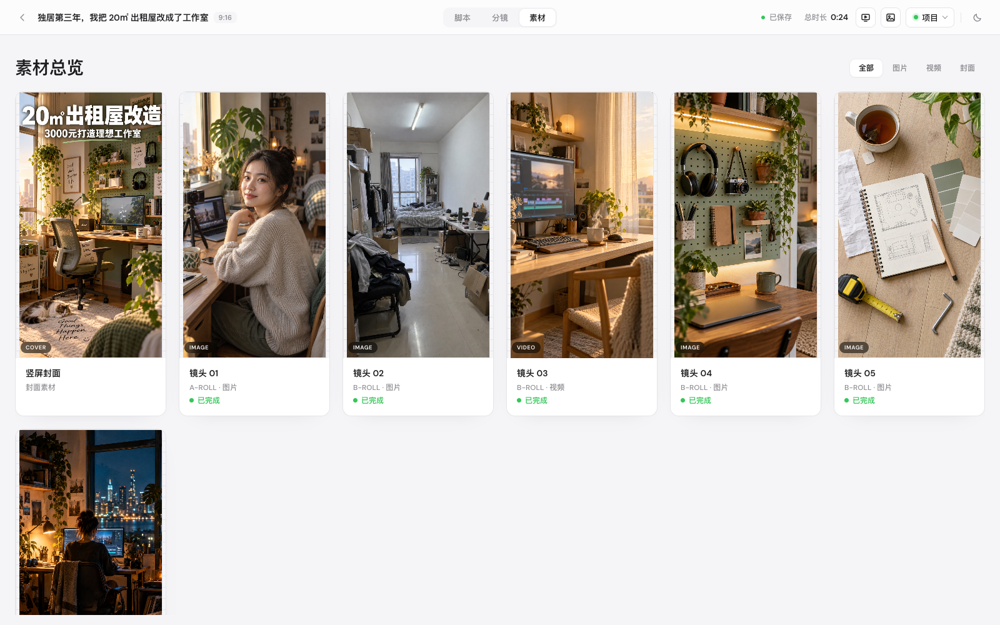<br><sub>素材总览</sub></td>
<td width="50%">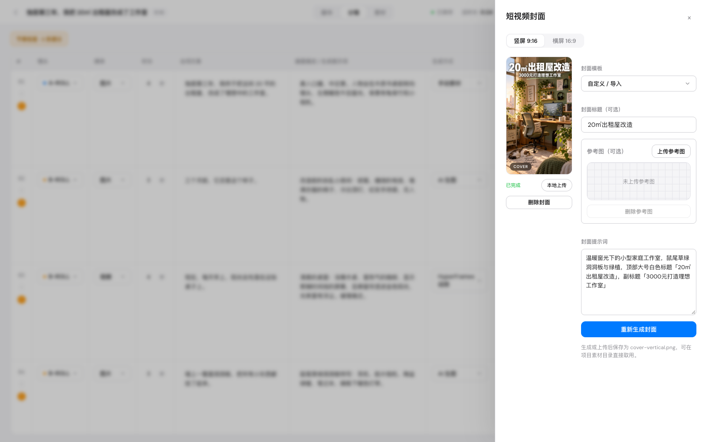<br><sub>封面工作台</sub></td>
</tr>
</table>

### 风格库与 DESIGN.md

12 种内置视觉风格，选中后写入项目的 `DESIGN.md`。之后所有图片和视频素材都会遵循这份视觉规范，单个镜头的明确要求优先。

<div align="center">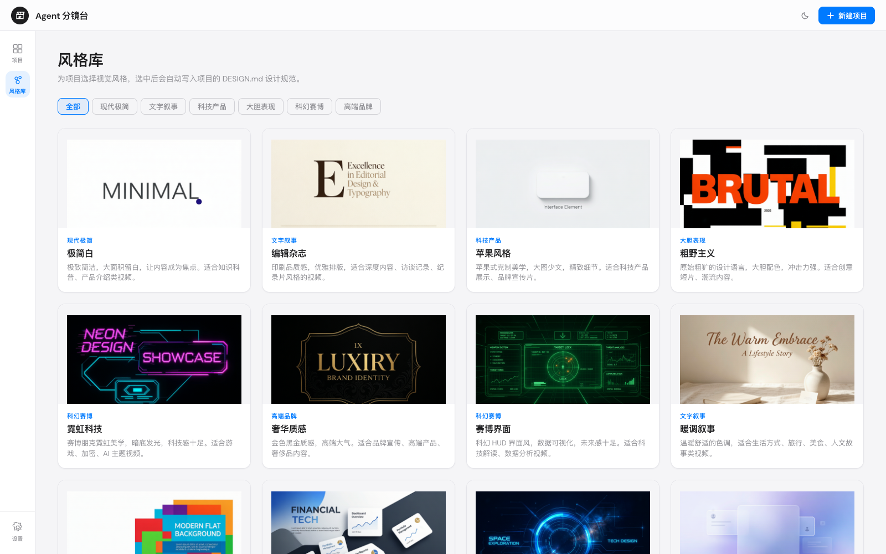</div>

### 深色模式，也适合窄窗口

跟随你的习惯切换主题。放进 Agent 的侧边栏这类窄窗口时，分镜表会自动变成卡片布局。

<table>
<tr>
<td width="66%">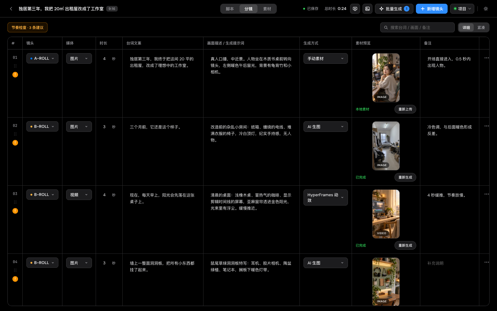</td>
<td width="34%">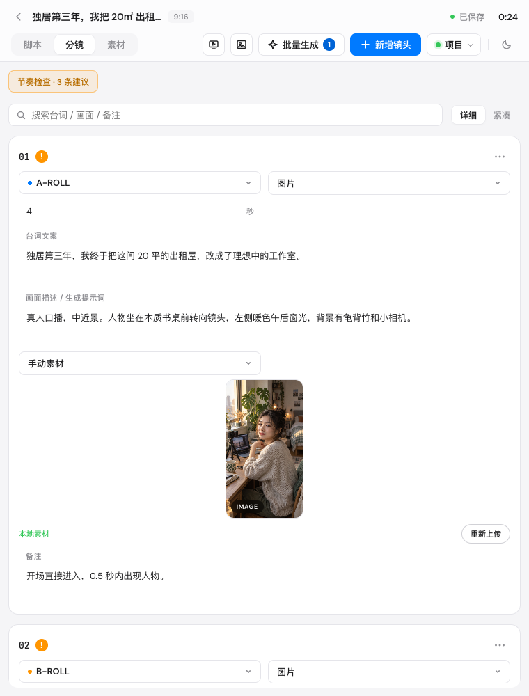</td>
</tr>
</table>

### 更多

| | |
| --- | --- |
| 多项目管理 | 新建、重命名、复制、搜索和删除项目 |
| 多画面比例 | `9:16`、`16:9`、`3:4`、`4:3`、`1:1` |
| 演示模式 | 逐镜头全屏预览，检查节奏 |
| 导出 | Markdown、HTML、Word、纯文本 |
| 本地素材 | 上传图片 / 视频，放大预览、替换和删除 |

## 🔧 环境与依赖

不需要 Python。设置里的「环境检查」只列真正需要关心的项目：

<table>
<tr>
<td width="55%" valign="top">

| 项目 | 用途 | 缺少时 |
| --- | --- | --- |
| 配音服务 | VoxCPM 在线服务（纯 Node 调用） | 需要联网 |
| FFmpeg | 配音转码、时长读取 | `brew install ffmpeg` |
| Whisper | 把配音对齐到台词 | 没有它仍可生成配音；`brew install whisper-cpp` |
| Codex CLI | 让 Claude Code 通过 Codex 生图 | 可选，也可用 Agent 自带生图或手动上传 |

</td>
<td width="45%" valign="top">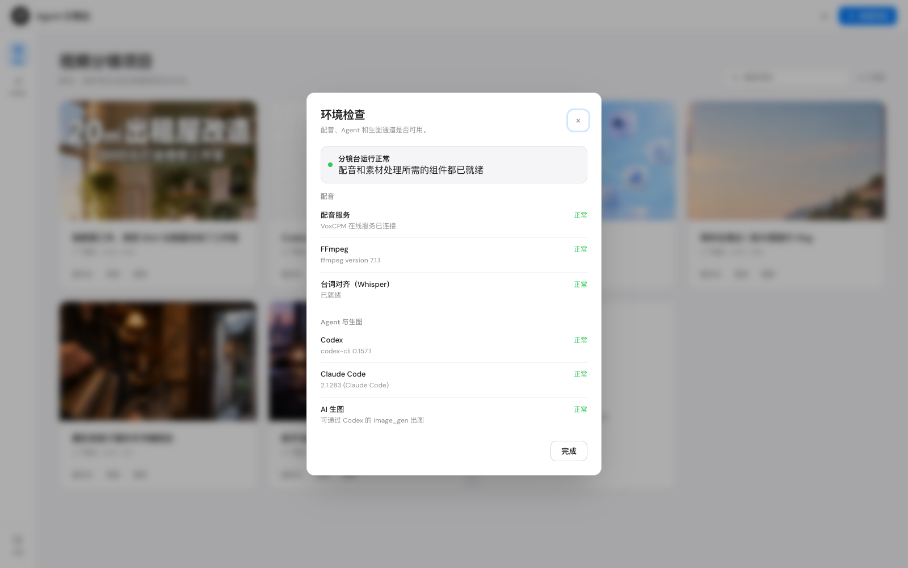</td>
</tr>
</table>

<details>
<summary>环境变量</summary>

旧版的 `CODEX_STORYBOARD_*` 仍然有效，新变量优先。

```text
AGENT_STORYBOARD_DATA_DIR      数据目录
AGENT_STORYBOARD_PORT          端口，默认 43218
AGENT_STORYBOARD_FFMPEG        FFmpeg 路径（同理 _FFPROBE、_WHISPER、_WHISPER_MODEL）
AGENT_STORYBOARD_VOXCPM_URL    自建配音服务地址
AGENT_STORYBOARD_VOICE_CHUNK_CHARS  配音每段最多多少字（默认 800）。越大接缝越少但音色越容易后段偏移，越小越稳但接缝越多
AGENT_STORYBOARD_CODEX         Codex CLI 路径
AGENT_STORYBOARD_CODEX_MODEL   生图时指定 Codex 模型（默认沿用 Codex 配置；若该模型不支持 ChatGPT 账号，会自动改用 gpt-5.5 重试）
```

</details>

## 🧰 MCP 工具

Agent 通过这些工具工作，不需要控制浏览器，也不会直接改数据文件。

| 工具 | 作用 |
| --- | --- |
| `open_storyboard` | 启动或连接本地分镜台，返回链接 |
| `create_storyboard_project` | 一次性创建完整项目、全部镜头和可选 `DESIGN.md` |
| `list_storyboard_projects` / `get_storyboard_project` | 查找项目、读取完整镜头 |
| `update_storyboard_project` / `delete_storyboard_project` | 修改镜头、比例、视觉规范；删除项目 |
| `list_storyboard_generation_tasks` | 读取待处理的生成任务 |
| `generate_storyboard_image` | 一次调用完成：认领任务、通过 Codex 出图、校验、回填 |
| `claim_…` / `complete_…` / `fail_…` / `heartbeat_storyboard_generation_task` | 处理动效视频等长任务 |
| `plan_broll_motion` | B-roll 动效的方案确认关口 |
| `manage_storyboard_audio` | 生成配音、选择版本、对齐台词、应用镜头时长 |
| `inspect_storyboard_environment` | 检查配音、FFmpeg、Whisper 和本机 Agent |

<details>
<summary>常用提示词</summary>

```text
打开 Agent 分镜台。
创建一个 9:16 的“AI 工具使用技巧”短视频分镜项目，直接写入分镜台。
帮我把这个项目补成 8 个镜头，每个镜头写出台词、画面描述、时长和生成方式。
处理所有待生成素材。优先生成 AI 生图，再生成动效视频。
查看当前有哪些分镜项目，找到标题里包含“AI 工具”的项目。
```

</details>

## 🔒 数据与隐私

- 项目、脚本和素材保存在本机，默认目录 `~/.agent-storyboard/`。用过旧版的话，已有的 `~/.codex-storyboard/` 会继续沿用，不会搬动或丢失。
- 本地服务只监听 `127.0.0.1`，并拒绝跨域请求。
- 配音会把台词发送到 VoxCPM 在线服务；通过 Codex 生图时，提示词会发送到 ChatGPT 的图片服务。请注意对应服务的隐私条款。

```text
~/.agent-storyboard/
  projects.json
  projects/<project-id>/
    project.json  DESIGN.md  media/  generation/
```

## 🛠 开发

```bash
git clone https://github.com/Yuuhann1999/agent-storyboard.git
cd agent-storyboard
npm start            # http://127.0.0.1:43218，数据在仓库内 ./data
npm run check        # 语法检查
npm test             # 单元与集成测试
```

网页使用原生 HTML、CSS 和 JavaScript，本地服务只用 Node.js 标准库，没有运行时 npm 依赖。

<details>
<summary>项目结构</summary>

```text
.
├── server.mjs                      本地服务（项目、生成任务、配音 API）
├── public/                         前端
├── voxcpm.mjs                      配音在线服务客户端
├── codex-image.mjs                 通过 Codex CLI 出图的桥接
├── runtime.mjs / audio.mjs         环境检查、FFmpeg / Whisper 调用
├── plugins/agent-storyboard/
│   ├── .codex-plugin/              Codex 清单
│   ├── .claude-plugin/             Claude Code 清单
│   ├── .mcp.codex.json             Codex 的 MCP 启动配置
│   ├── mcp/server.mjs              MCP 服务
│   ├── skills/                     Agent 使用说明
│   └── app/                        随插件打包的服务和前端副本
├── .agents/plugins/marketplace.json    Codex marketplace
└── .claude-plugin/marketplace.json     Claude Code marketplace
```

根目录的 `server.mjs` 和 `public/` 是主要编辑入口，改完后同步到 `plugins/agent-storyboard/app/`（`npm test` 里有一致性检查）。

</details>

<details>
<summary>本地调试插件</summary>

```bash
codex plugin marketplace add .
codex plugin add agent-storyboard@agent-storyboard

claude plugin marketplace add .
claude plugin install agent-storyboard@agent-storyboard

claude plugin validate .
```

</details>

<details>
<summary>主要本地 API</summary>

```text
GET    /api/health
GET    /api/environment
GET    /api/projects                        POST 可一次性传入 shots 创建完整项目
GET    /api/projects/:id                    PUT / PATCH / DELETE
GET    /api/projects/:id/design             POST / DELETE
POST   /api/projects/:id/shots              PATCH / DELETE /shots/:shotId
POST   /api/projects/:id/shots/:shotId/media
POST   /api/projects/:id/audio/generate     select / align / apply-durations
GET    /api/generation/tasks                POST 入队
POST   /api/generation/tasks/:taskId/claim  complete / fail / cancel / heartbeat
```

</details>

## License

[MIT](LICENSE)
