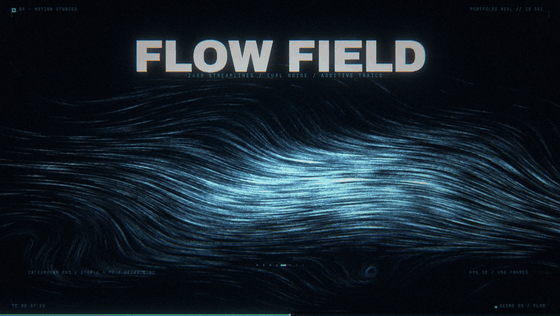
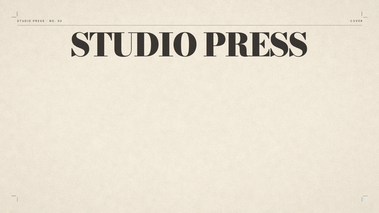
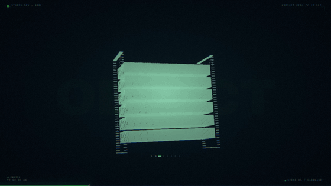
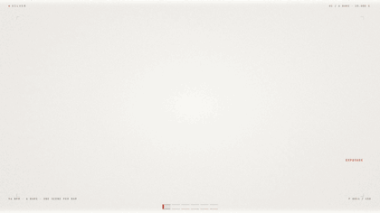
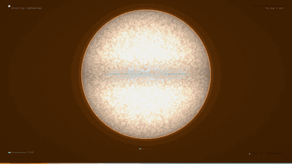
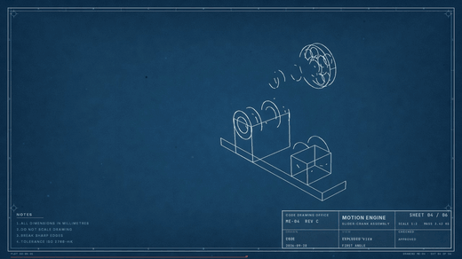
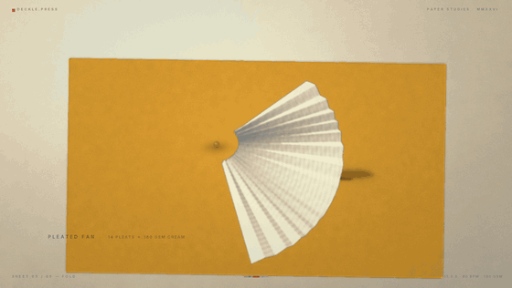
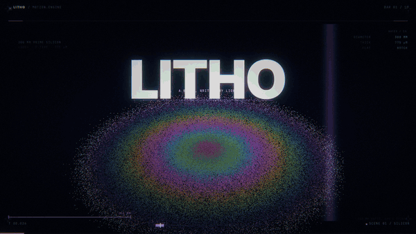
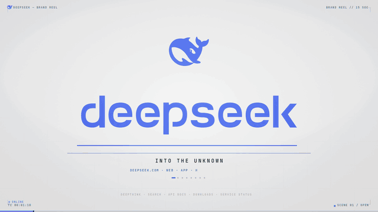

# RuiC-motion-reel

**用代码生成 15 秒动态图形（Motion Graphics）成片，交付 1920×1080 / 30fps（450 帧）。**
画面和音乐全部由代码产出——不依赖任何外部美术素材，也不打开 After Effects。

同一套引擎换一套视觉语言就是一支新片：暗色科技 HUD、riso 三色印刷、纸艺、银盐暗房、
恒星普朗克配色、氰版蓝图、紫外光刻、品牌亮色产品片——下面那张表每一格各是一支，
完整成片在 [`docs/films/`](docs/films/)。

> **本 skill 由作者用 DeepSeek Flash 跑通**：从建模、排版、分色到配乐与出片，
> 整条链路都是它自己跑出来的。
> **不绑定模型** —— 支持各大主流多模态模型，任何能读写文件、执行命令的编码 Agent 都能用。

这是一个 Agent Skill（给 ZCode / Claude Code 这类编码 Agent 用）：装上之后，
一句「用代码做一条 15 秒动态图形片」就能从零到出片。

| 暗色科技 · 流场 | 丝网印 / riso · 封面 | 3D 建模 · 点云渲染 |
|---|---|---|
|  |  |  |
| **银盐 / 暗房 · SILVER** | **恒星 · KELVIN** | **氰版蓝图 · MOTION ENGINE** |
|  |  |  |
| **纸艺 · DECKLE** | **紫外光刻 · LITHO** | **品牌亮色产品片 · BRAND LIGHT** |
|  |  |  |

> 最后一格是 **DeepSeek** 的品牌片（[`brand-light-demo-15s.mp4`](docs/films/brand-light-demo-15s.mp4)）：
> 鲸鱼标与字标取 deepseek.com 官网内联 SVG 的原路径（不是重排的近似字体），
> 色值逐条取自其设计 token（`--ds-color-brand` `#4d6bfe` 等），产品界面按其亮色主题自绘。
> **这是用本引擎做的排版与管线演示，与 DeepSeek 无隶属关系，商标归其所有者。**


## 它能做什么

- **15 秒成片，1920×1080 / 30fps**（450 帧），锁在音乐网格上（128 BPM × 8 小节 = 15.000 秒整），
  每个场景正好一小节，**每一次剪辑都落在强拍上**
- **字体排版**：2× 超采样矢量/文字通道、字距排版、字号按目标宽度反解
- **真 3D**：参数曲面建模 + 点云渲染（排序散射做精确遮挡）+ 隐藏线线刻
- **印刷管线**：分色成四块油墨版、旋转网线做网点、乘法定律叠印、
  套印偏移、纸纹、裁切线、套准规
- **配乐合成**：打击乐 / 贝斯 / FM 电钢 / 钟 / 铺底 / riser / impact，
  加磁带抖晃与混响，无采样
- **颜色也能是被算出来的**：给一个物理量就直接得到颜色——黑体温度
  （Planck → CIE 1931 → sRGB）、谱线波长、薄膜干涉（氧化层厚度 → 反射光谱）。
  LITHO 里曝光光是 405 nm 反解的那支紫，晶圆彩虹是 SiO₂ 厚度 20–780 nm 积分出来的
- **16 张风格牌，默认随机抽**：暗色霓虹只是其中一张，抽到编辑排版、手绘速写、
  纸艺、标本图录、柔光渐变就照做——**轻的做干净了一样好看**。抽签结果写进项目的 `STYLE.md`
- **出片链**：多进程逐场并行渲染 → H.264 编码 → 混音，1080p30 的 15 秒约 3~8 分钟（排版重的牌更久）

## 安装

```bash
git clone https://github.com/HRuiCcc/RuiC-motion-reel.git \
  ~/.agents/skills/ruic-motion-reel
```

依赖：`python3`（numpy + Pillow）、`ffmpeg`。字体随包（OFL）。

```bash
pip install numpy pillow
```

## 用法

**给 Agent 用**（推荐）：把 skill 装到 `~/.agents/skills/` 下即可，
Agent 会在你说「用代码做个动效视频 / 生成一条 15 秒作品集样片 / 给某个品牌做一条片子」时自动使用它。

**手动用**：

```bash
# 起一支新片
python3 ~/.agents/skills/ruic-motion-reel/scripts/new_reel.py ~/my-reel --name my_reel
# 默认抽一张风格牌（写进 STYLE.md）；--style <id> 指定，--style none 关掉

cd ~/my-reel
# 改 my_reel/theme.py：品牌、时间网格、色板、文案
# 改 my_reel/scenes.py：八个场景

python3 -m my_reel.build --stills 0     # 抽一场的 7 帧审阅
python3 -m my_reel.build --at 3:1.20    # 某一拍的单帧全分辨率
python3 -m my_reel.build                # 出全片
```

产物在 `out/`。

## 仓库结构

```
SKILL.md               Agent 的主工作流（触发条件、流程、硬规矩）
engine/                共享渲染引擎
  core.py              画布、矢量文字通道、bloom/色差/颗粒、
                       印刷原语（叠印 multiply、网点、纸纹、套印偏移）
  three.py             3D：参数曲面、相机、点云渲染、隐藏线
  fonts.py             字体栈、字距排版、基线换算、字号反解
  anim.py              缓动、错帧、值噪声
  dsp.py               合成器 DSP：FFT 时变滤波、磁带抖晃、混响、频谱分析
template/              可跑的最小工程（8 个场景 + 一段配乐）
scripts/
  new_reel.py          从模板起一支新片（默认抽一张风格牌，写进项目 STYLE.md）
  style_lottery.py     16 张视觉语言的牌堆，抽签 / 列牌 / --avoid 上一张
  preview_gif.py       成片或帧序列 → README 用的循环预览 GIF
  perf_probe.py        逐算子 CPU vs CuPy，看换显卡到底能省多少
references/            按需加载的细节文档
  design-grammar.md    设计语法：时间网格、排版、构图、动效、亮度校准
  three-d.md           3D 引擎用法与配方
  print-pipeline.md    分色、网点、叠印、版面家具
  audio-dsp.md         配乐合成
  gotchas.md           踩过的坑（近 40 条，症状与真因）
  performance.md       一帧花在哪、换显卡能省多少（实测）
assets/fonts/          随包字体（OFL 1.1，见 NOTICE.md）
assets/wechat-donate.png  赞赏码
```

## 设计上的几个立场

**时间先有网格，再有镜头。** 「剪辑点落在强拍上」不是后期对轴对出来的，
是结构决定的——一个小节一个场景，所以音乐和画面共用一条时间轴。

**3D 不用三角形光栅化器。** Python 里逐三角形太慢；把曲面密采样成点云、
投影后按深度排序散射（numpy 对重复下标保留最后一次写入 = 画家算法），
遮挡精确、无逐三角形循环，而且密集点云自带颗粒感——铜版雕刻也是这个原理。

**颜色是被算出来的，不是被指定的。** 印刷管线把明暗拆成几块油墨版，
各自用不同网线角度做网点，再以乘法叠印。粉压蓝是真紫、黄压蓝是真绿——
中间调是油墨自己叠出来的。

**品牌色必须实测。** 官网样式表、产品截图，不要凭印象挑。
亮色品牌的暗色版不是另选一套色，而是把同一套色读到曝光的另一端。
品牌 logo 同理——取官网的原始 SVG/PNG，不要手画，也不要把字标重排成「像 logo 的字体」。

**亮底片的后期是反的。** 暗场里 bloom 阈值 0.68 就够，亮场要抬到 0.99（纸白本身 0.97），
品牌色满幅时甚至要抬到 1 以上（品牌蓝的 B 通道 0.996 会把自己的底板点着）。阈值低于底板亮度，整帧就被自己的底色洗白——**这个症状看起来像调色不对，真因在阈值**。

## 已知的坑都写在代码注释里

`references/gotchas.md` 有 40 多条，每条都是真踩过的，而且症状都不指向真因。举三个：

- PIL 的字形包围盒是相对 **ascender** 而非基线，按字高居中会整体低一个字身（168px 字号偏 147px）
- 重叠相加滤波要除以**窗和**（窗只加了一次）；除以窗平方和会引入 2× 纹波，
  且首尾样本会把舍入噪声放大上千倍
- AAC 编码后**采样间峰值超过采样峰值**，采样峰值定 0.92 会得到 +0.3 dBTP（已超 0 dBFS）

## 赞赏支持

<div align="center">
  
  <p><strong>微信扫码赞赏</strong></p>
</div>

---

## 协议

代码 MIT（见 `LICENSE`）。随包字体为 SIL Open Font License 1.1，
版权与协议见 `assets/fonts/NOTICE.md` 与 `assets/fonts/OFL.txt`。
