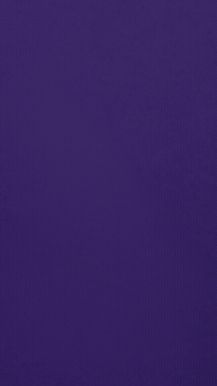
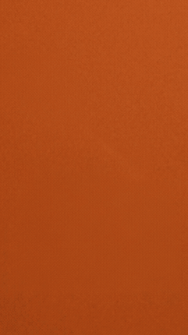
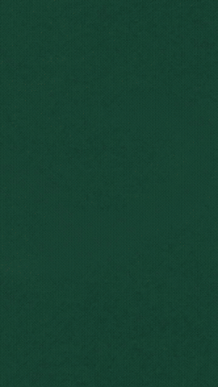

<pre>
   _____                   _____            .__
  /     \ _____  ___  ____/ ____\_ __  _____|__| ____   ____
 /  \ /  \\__  \ \  \/  /\   __\  |  \/  ___/  |/  _ \ /    \
/    Y    \/ __ \_>    <  |  | |  |  /\___ \|  (  <_> )   |  \
\____|__  (____  /__/\_ \ |__| |____//____  >__|\____/|___|  /
        \/     \/      \/                 \/               \/
</pre>

# Collage B-roll Explainers

A [Claude Code](https://claude.com/claude-code) skill that turns a single spoken sentence into a premium editorial **paper-collage explainer video** — 9:16, 5 seconds, halftone cut-outs assembling piece by piece on a bold color field, optionally with a fitted voiceover.

You give it a line like *"A snowball only needs the first push — the hill does the rest."* It proposes a visual metaphor, waits for your approval, generates the finished still, waits again, then animates the whole scene assembling itself from an empty color field — and QAs its own output frame by frame.

## Examples

| | | |
|:---:|:---:|:---:|
|  |  |  |
| *"A snowball only needs the first push — the hill does the rest."* | *"One flame can light the whole room — and lose none of its fire."* | *"Tip the first tile — and the rest of your week runs itself."* |

Full-quality MP4s (with voiceover) are in [`examples/`](examples/).

## What the skill enforces

- **Three-gate approval flow** — metaphors first, stills second, video last. You approve at each gate; nothing burns generation cost on an unapproved idea.
- **A locked visual language** — flat bold paper fields, black-and-white halftone photographic cut-outs, colored cardstock accents, crisp cut edges, cream keylines, paper grain. Color semantics are part of the system (burnt orange = urgency, deep purple = rules, teal = judgment…).
- **Assemble-from-empty motion** — the clip opens on a pure empty color field and builds the scene piece by piece with stop-motion timing. First and last frames are prepared locally with ffmpeg and passed as tagged references, so the video lands exactly on the approved still.
- **Self-QA** — contact sheets, first-frame purity checks, end-frame comparisons, an anti-fake-lettering rule set, and a repair playbook for the failure modes that actually happen.
- **Voiceover fitting** (optional) — pick a voice from your library, generate the line, trim silence, fit it into a 4–5s window, and mux — video stream untouched.

## Requirements

- **Claude Code** (or any agent with local file access) with **ffmpeg** installed — frame prep, QA, and muxing run locally on your machine.
- **[MaxFusion](https://maxfusion.ai) MCP** — all image, video, and speech generation runs through it.

## Install

1. Drop `SKILL.md` into your skills directory:

   ```bash
   mkdir -p ~/.claude/skills/collage-broll-explainers
   curl -o ~/.claude/skills/collage-broll-explainers/SKILL.md \
     https://raw.githubusercontent.com/MegaTroll222/VOX-COLLAGE-BROLL/main/SKILL.md
   ```

2. Connect the MaxFusion MCP server:

   ```bash
   claude mcp add --transport http maxfusion https://mcp.maxfusion.ai/mcp
   ```

   The first call will ask you to authenticate with your MaxFusion account.

3. In Claude Code, say something like:

   > *make a collage b-roll for: "Nobody misses washing dishes by hand."*

   The skill proposes metaphors and takes it from there. When you want a voiceover, it lists the voices in your MaxFusion library and asks you to pick one.

## Using it without MaxFusion

The skill file is written for the MaxFusion MCP tool surface, but the pipeline is portable. If you'd rather bring your own keys, you'll need:

- a **Google AI Studio API key** — for the image generation (the stills) and the Gemini video model that does the assemble-from-empty animation from first/last-frame references, and
- an **ElevenLabs API key** — for the voiceover stage.

Swap the `maxfusion_*` tool calls in `SKILL.md` for your own scripts against those APIs; everything else (prompt templates, gates, ffmpeg frame prep, QA, the fix ladders) stays exactly the same. That is in fact how the original project worked — see credits below.

## Credits

This skill is an English adaptation of **[gbro-collage-broll](https://github.com/pyang5166/gbro-collage-broll)** by **[pyang5166](https://github.com/pyang5166)**, who designed the visual language, the three-gate flow, the prompt templates, the color semantics, and the QA/repair playbook — originally in Chinese, built for Codex with local Gemini scripts.

This version adapts it for Claude Code + MaxFusion MCP, translates it to English, and adds the voiceover-fitting stage. All credit for the core idea and the craft belongs to the original author.

## License

[MIT](LICENSE)
